# Setting up Sonarqube server

Sonarqube is running statically as docker container and is set up via SSH and the following command. Attention: This is a evaluation installation and SQ should be installed on a separate host. This is for demonstration purposes only.

## Install

```bash
docker run -d --name sonarqube -e SONAR_ES_BOOTSTRAP_CHECKS_DISABLE=true -p 9000:9000 sonarqube:latest
```

## Configuration

### Allow access from local host

Configure Virtualbox to forward the port.

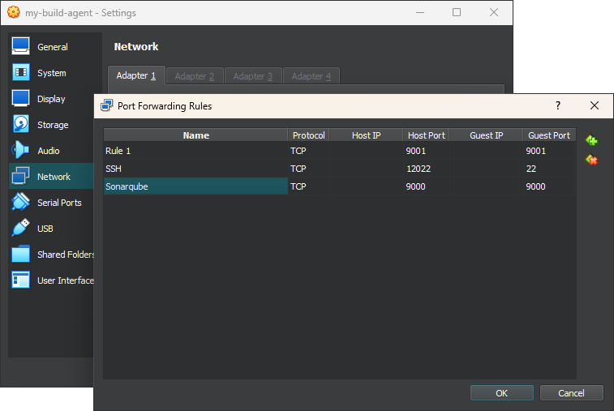

Open [Sonarqube](http://localhost:9000) in your browser and login with username and password being `admin`. When prompted change the password to something you will remember:

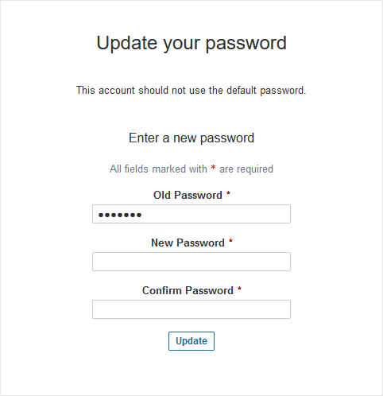

Create a new local project.

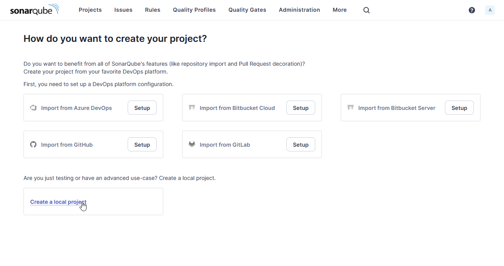

Configure project

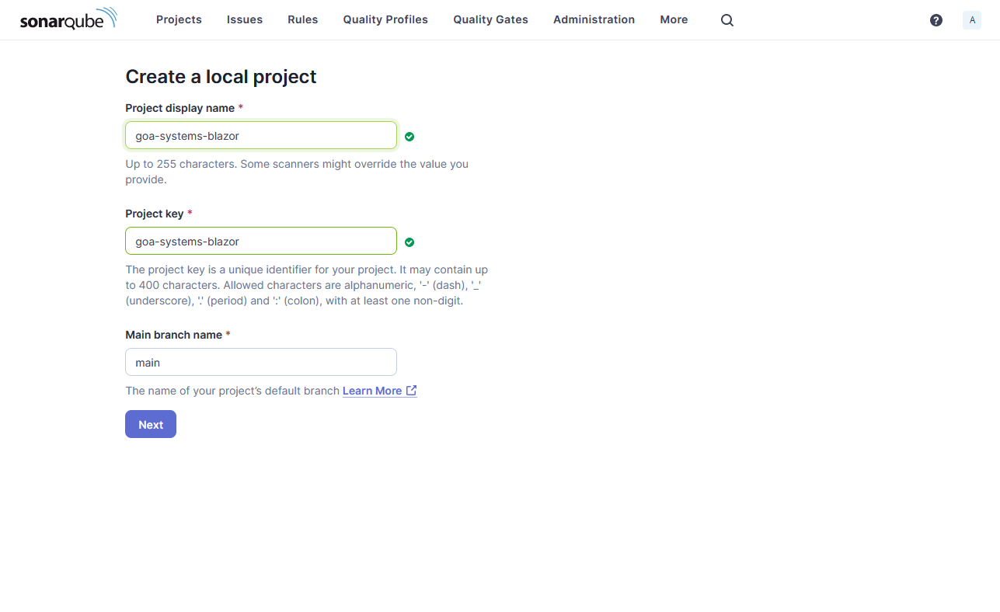

Apply standard values

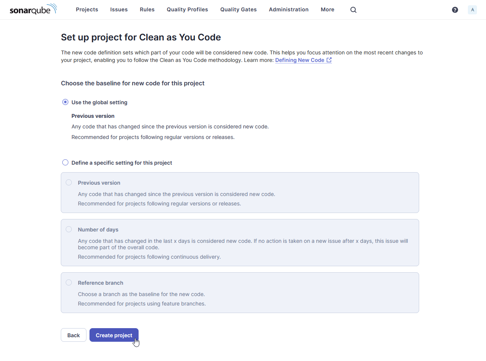

Configure local analysis (most generic one)

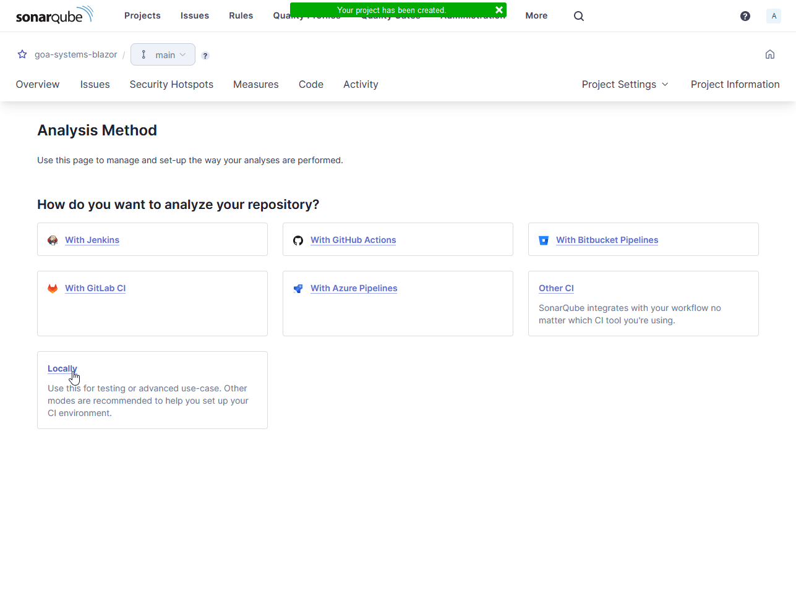

Generate token

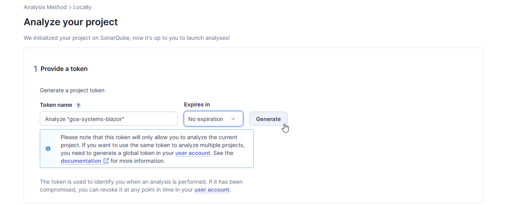

And click on "Continue". Your token is shownand select "Other".

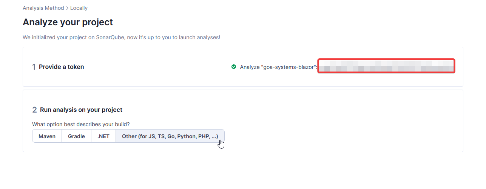

In the boy you get all the information you need to run the scan.

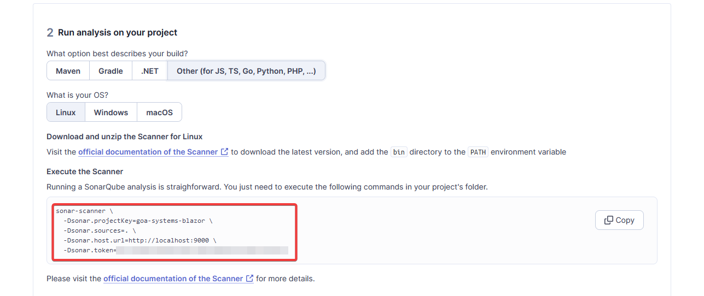

Finally add a code analysis step to the pipeline:

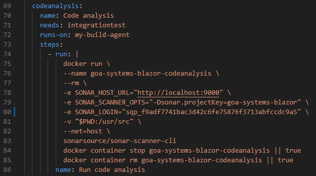

After the pipeline run is complete code analysis should be shown in Sonarqube:

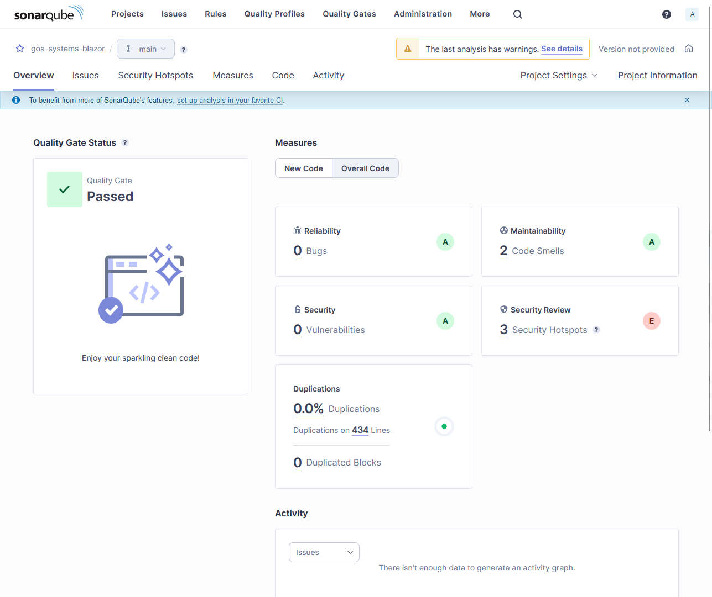

## Uninstall

```bash
docker container stop sonarqube
docker container rm sonarqube
docker image rm sonarqube:latest
```