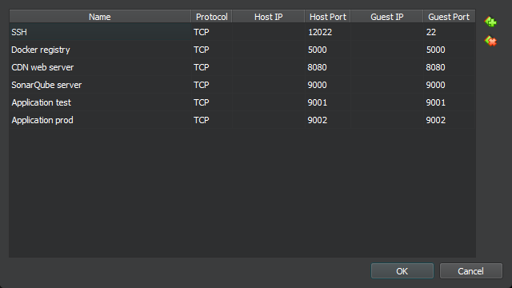

# Presentation notes

## Ports

|Port|Usage|
|-|-|
|22|SSH access to the machine|
|5000|Container registry|
|8080|CDN Webserver|
|9000|SonarQube server|
|9001|Application test server|
|9002|Application production server|



## Static services

This section describes how to setup the required services.

### Registry

Run the following as root to start a registry.

```bash
docker run -d -p 5000:5000 --restart always --name registry registry:2
echo "{\"insecure-registries\" : [\"localhost:5000\"]}" > /etc/docker/daemon.json
```

### Webserver

The following code launches a [nginx](https://nginx.org) webserver and configures it to allow directory listings.

```bash
mkdir /home/svcgithub/wwwroot
docker run --restart=always --name nginx -v /home/svcgithub/wwwroot:/usr/share/nginx/html:ro -d -p 8080:80 nginx:latest
docker cp nginx:/etc/nginx/conf.d/default.conf default.conf
sed -i -E 's/^(.*)index\.htm;/\1index.htm;\n        autoindex on;/g' default.conf
docker cp default.conf nginx:/etc/nginx/conf.d/default.conf
docker stop nginx
docker start nginx
```

### SonarQube

Please see the separate Sonarqube documentation for instructions.

## Final result

```
root@my-build-agent:~# docker container ls --all
CONTAINER ID   IMAGE                                     COMMAND                  CREATED          STATUS          PORTS                                       NAMES
16fd593e8601   localhost:5000/goa-systems-blazor:0.0.1   "dotnet Goa.Systems.…"   56 seconds ago   Up 55 seconds   0.0.0.0:9002->9002/tcp, :::9002->9002/tcp   gsbprod
8378f86b537b   sonarqube:latest                          "/opt/sonarqube/dock…"   9 minutes ago    Up 9 minutes    0.0.0.0:9000->9000/tcp, :::9000->9000/tcp   sonarqube
4f4f33c6869b   registry:2                                "/entrypoint.sh /etc…"   11 minutes ago   Up 11 minutes   0.0.0.0:5000->5000/tcp, :::5000->5000/tcp   registry
9057a5bc0f8d   nginx:latest                              "/docker-entrypoint.…"   15 minutes ago   Up 15 minutes   0.0.0.0:8080->80/tcp, :::8080->80/tcp       nginx
```